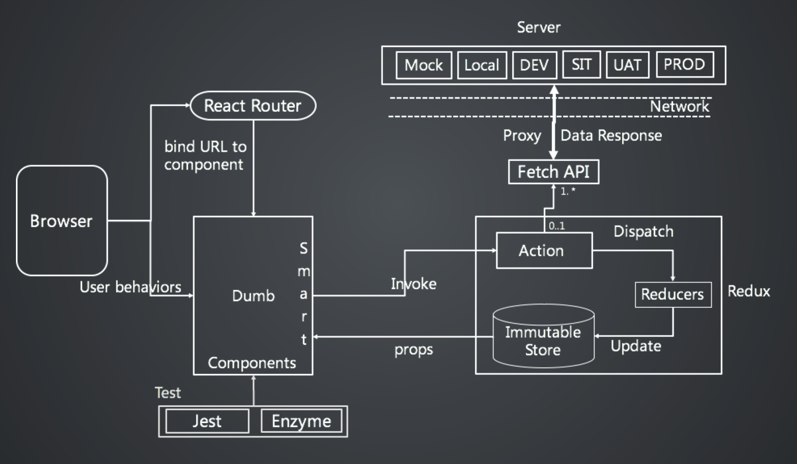

# React Sample - A starter boilerplate for React based web app project, powered by create-react-app.

Besides [Create React App](https://github.com/facebookincubator/create-react-app). This sample project also uses:
> Data Flow Management - [Redux](http://redux.js.org/);  
> Redux Ducks Pattern - [Ducks](https://github.com/erikras/ducks-modular-redux);  
> Declarative routing - [React Router](https://github.com/ReactTraining/react-router);  
> React Components that Implement Google's Material Design. - [Material UI](https://github.com/callemall/material-ui);  
> Mock Server based on Express - [Mock Server](https://shinxi.github.io/react/#/6/1);  

## Overview

* [Getting Started](#getting-started)
* [Technology stack](#technology-stack)
* [Separation of front-end and back-end](#separation-of-front-end-and-back-end)
* [Code Standard](#code-standard)

## Getting Started

* Quick start

See [How to run react-sample at local](./docs/how_to_run.md) for more detail.

* IDE Guidance for increasing development experience

See [How to setup JavaScript Development Environment - VS Code](./docs/how_to_setup_ide.md) for more detail.

* Project folder introduction

```bash
react-sample/
├── .editorconfig         - editor config file
├── .env                  - for absolute import
├── .eslintrc.js          - eslint settings
├── package.json          - npm 3rd-lib configuration
├── README.md
├── node_modules          - npm 3rd libraries
├── public                - assets that won't be processed by webpack
│   └── oauth_callback    - oauth callback
│   └── index.html
│   └── favicon.ico
├── server                - mock server
└── src                   - source codes
    └── index.css            - entry file css
    └── index.js             - entry file
    └── redux/               - redux by ducks pattern
    └── components/          - Dumb components
    └── containers/          - Smart components that connected to redux
```

## Technology stack



## Separation of front-end and back-end

See why and how at [Separation of front-end and back-end](./docs/separation_of_fe_be.md).

## Code Standard

Follow [Airbnb JavaScript Style Guide](https://github.com/airbnb/javascript).
