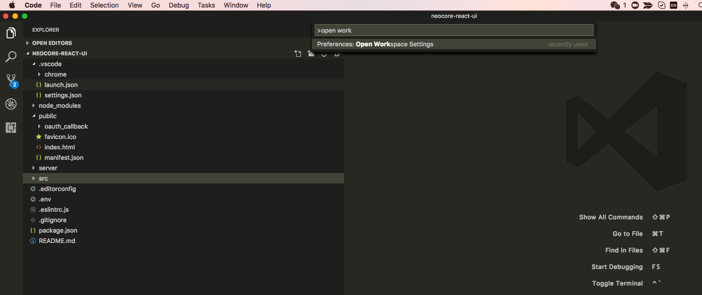

# How to run neocore-react-ui at local

## Prerequisites

* Make sure you have installed [Node.js](https://nodejs.org/en/) v6.11+ (You have to [downgrade your node version](./downgrade_node_version.md) if you encounter npm EINTEGRITY issue)
* [How to setup JavaScript Development Environment - VS Code](./how_to_setup_ide.md)

## Install

1. Open terminal, clone your forked repo.

```git clone https://github.com/euler-ui/react-sample```

1. ```cd react-sample```
1. Install dependencies.

```npm install```

1. Run the mock server.

```npm run server```

1. Open another terminal
1. Start application.

```npm start```

1. Enjoy at the url printed at terminal. E.g., `http://localhost:3000/`

## VS Code setup for auto-formatting/linting

1. Open ```react-sample``` with VS Code
1. Open  Command Palette (⇧⌘P), type ```Open Workspace Settings```, and select ```Preferences: Open Workspace Settings```



1. Copy below content into opened settings.json.

```javascript

// Place your settings in this file to overwrite default and user settings.
{
    // Format a file on save. A formatter must be available, the file must not be auto-saved, and editor must not be shutting down.
    "editor.formatOnSave": true,
    "stylelint.enable": true,
    "css.validate": false,
    "scss.validate": false,
    // Enable/disable default JavaScript formatter (For Prettier)
    "javascript.format.enable": false,
    // Use 'prettier-eslint' instead of 'prettier'. Other settings will only be fallbacks in case they could not be inferred from eslint rules.
    "prettier.eslintIntegration": true,
    "prettier.singleQuote": true,
    "prettier.trailingComma": "all",
    "prettier.printWidth": 100,
    "search.exclude": {
      "**/node_modules": true,
      "src/routes":true,
      "*config.js":true,
      ".eslintrc.js":true,
      "*config.prod.js":true
    }
}

```

1. Enjoy live lintin and auto formatting with VS Code

## Next steps

You may need to find out:

* [How to test front-end requests](./how_to_test_request.md).
* [Separation of front-end and back-end](./separation_of_fe_be.md).
* [How to debug your code at VS Code](./how_to_debug_code.md).
