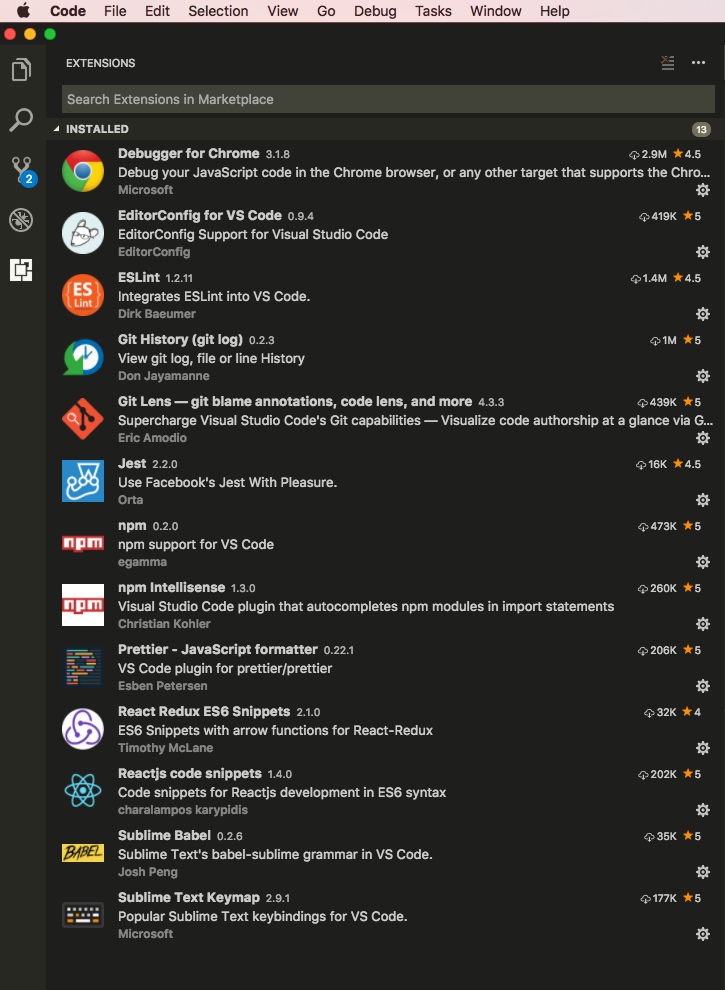

# How to setup JavaScript Development Environment - [VS Code](https://code.visualstudio.com/)

## Expectations for IDE

### Code auto formatting/fixing & linting

* When I save a file, I want codes be auto formattered/fixed by [Javascript Rules](https://github.com/ServiceMax-Engineering/javascript)

* And IDE can display hints for those rules can't auto formattered/fixed.

### Code Navigation

* I want to easily navigate through files/APIs/methods etc.

### Auto complete

* I can't remember all API and it takes time to look into API documents, so that it'll be great if IDE can give me API suggestions.

### VCS integration

* That'll be nice if I can pull/commit/push code at IDE, and it'll be great if I can also view history/blame annotations/diff files etc.

### Debugging

* We are used to debugging JS code at browser, that's good. But if we can also debug JS code like Java code at IDE, that'll be nice. This enables write and debug our code without leaving the editor, and most importantly it enables a continuous development workflow, where context switching is minimal, as you don’t have to switch between tools.
  * Before:

  Make Code change -> Switch to Chome DevTools -> Set breakpoint -> Debug -> Switch back to VS Code -> Make code change

  * After:

  Make Code change -> Press F5 -> Set breakpoint -> Debug -> Make code change

## What is VS Code

> VS Code is a new type of tool that combines the simplicity of a code editor with what developers need for their core **edit-build-debug** cycle. Code provides comprehensive editing and debugging support, an extensibility model, and lightweight integration with existing tools.

### VS Code Features

* Meet IntelliSense.

VS Code provides smart code-completion/parameter-info/quick-info/member-lists/code-navigation based on variable types, function definitions, and imported modules.

* Print statement debugging is a thing of the past.

Debug code right from the editor. Launch or attach to your running apps and debug with break points, call stacks, and an interactive console.

* Git commands built-in.

Working with Git and other SCM providers has never been easier. Review diffs, stage files, and make commits right from the editor. Push and pull from any hosted SCM service.

* Extensible and customizable.

By install extensions, we are able to have more awesome features like auto-formatting/linting etc.

## Why just VS Code, not Atom/Sublime/Webstorm

* With same IDE, it can save time on IDE configuration, with same IDE, code can have same formatting.
* And given by awesome VS Code features above, just choose VS Code as our primary IDE.
* VS Code is good at auto-complete/auto-fomratting/git integration/code navigation/debugging etc.
* VS code is friendly to React apps, create-react-app mentioned VS Code multiple times at its [User Guide](https://github.com/facebookincubator/create-react-app/blob/master/packages/react-scripts/template/README.md).
* Other IDEs like Atom/Sublime/Webstorm they are all good, expectations can also be achieved by installing plugins/extensions on each of them, but, we have to take time to figure out what plugins/extension need to use, it may takes 2 days or even more on setting up these IDEs. So Atom/Sublime/Webstorm will be seconday choice, and we might add other guildlines on these IDE later.

## Install

### Install VS Code

Follow [Running VS Code on Mac](https://code.visualstudio.com/docs/setup/mac) to install VS Code.

### Install Extensions

Extension Name | Description | Requirement
------------ | ------------- | -------------
EditorConfig for VS Code | [EditorConfig](http://editorconfig.org/) for Visual Studio Code. EditorConfig helps developers define and maintain consistent coding styles between different editors and IDEs | Required
ESLint | VS Code [ESLint](http://eslint.org/) extension. ESLint is an open source project originally created by Nicholas C. Zakas in June 2013. Its goal is to provide a pluggable linting utility for JavaScript.| Required
Prettier | VS Code package to format your Javascript / Typescript / CSS using Prettier. | Required
Debugger for Chrome  | Debug your JavaScript code running in Google Chrome from VS Code. | Required
React Redux ES6 Snippets | React-Redux snippets for Visual Studio Code using ES6 and arrow functions. | Required
Reactjs code snippets | This extension contains code snippets for Reactjs and is based on the awesome babel-sublime-snippets package. | Required
Git History | View git log along with the graph and details. View the history of a file (Git log) or the history of a line in a file (Git Blame). View a previous copy of the file. Compare a previous version with the version in the workspace or another. View commit log details for a selected commit. Compare commits. | Optional
Git Lens | GitLens supercharges the built-in Visual Studio Code Git capabilities. It helps you to visualize code authorship at a glance via Git blame annotations and code lens, seamlessly navigate and explore the history of a file or branch, gain valuable insights via powerful comparison commands, and so much more. | Optional
Sublime Babel | When using your favorite theme, Visual Studio Code doesn't always display syntax highlight colors as expected. This extension tries to mimic Sublime Text's babel-sublime package as much as possible to address poor coloring. | Optional
vscode-jest|A comprehensive experience when using Facebook's Jest within a project.|Optional
npm | This extension supports running npm scripts defined in the package.json file and validating the installed modules against the dependencies defined in the package.json. | Optional
Npm Intellisense | Visual Studio Code plugin that autocompletes npm modules in import statements. | Optional
Sublime Text Keymap | Sublime Text Keymap for VS Code | Optional

## Next steps

You may need to find out:

* [How to run react-sample at local](./how_to_run.md)
* [How to debug at VS Code](./how_to_debug_code.md)
